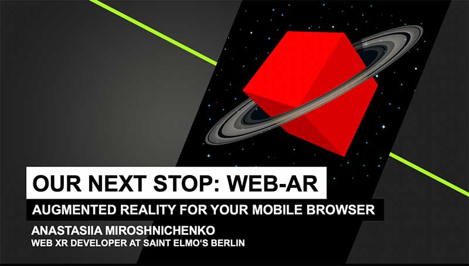

## Web AR: Augmented reality for your browser.

<a href="https://phpconference.com/" rel="nofollow">International PHP Conference.</a> June 3-7 2019, Berlin.

#### The world of technology is moving very fast. You have heard that AR is said to be the next big thing – and yet we already have a new topic popping up: Web-AR: the power of AR without the need for an Application.

To run the experience scan this QR-code:
 

Hiro Marker:
 

Copyright
-------

The content of this presentation is proprietary and confidential information of Saint Elmo’s Berlin GmbH & Co. KG. The document and the information in it are provided in confidence, for the sole purpose of exploring business opportunities between the disclosing party and the receiving party and may not be disclosed to any third party or used for any other purpose without the express written permission of the disclosing party.
